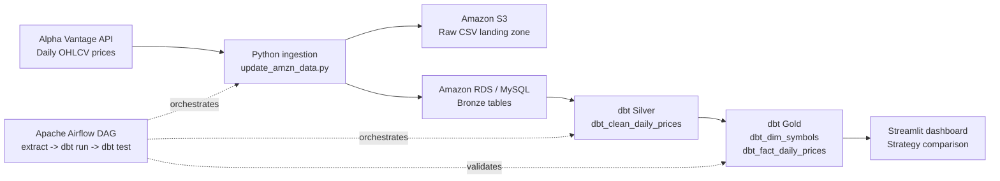

# Stock Market ELT Pipeline for Trading Strategy Analysis

This project is a cloud-ready Data Engineering pipeline for stock market data.
It extracts daily OHLCV prices from the Alpha Vantage API, lands raw extracts in
Amazon S3, loads structured Bronze data into MySQL/Amazon RDS, transforms the
data with dbt into Silver and Gold models, validates data quality, and serves
the final tables to a Streamlit trading strategy analysis dashboard.

The project started as a thesis trading strategy evaluation framework and was
extended into an end-to-end ELT pipeline to demonstrate ingestion, cloud
storage, relational modeling, transformation, orchestration, and analytics.

## Architecture



## Key Features

- Extracts daily stock prices from Alpha Vantage for configurable symbols.
- Stores raw API extracts in Amazon S3 as partitioned CSV files.
- Loads structured Bronze records into MySQL or Amazon RDS MySQL.
- Uses dbt to build Silver cleaned data and Gold analytical tables.
- Runs Python validation checks and dbt data quality tests.
- Orchestrates ingestion, transformation, and validation with Airflow.
- Powers a Streamlit dashboard for strategy analysis and comparison.
- Keeps secrets out of Git through `.env`-based configuration.

## Tech Stack

| Tool | Role |
| --- | --- |
| Python | API ingestion, validation, S3 upload, RDS/MySQL loading |
| Alpha Vantage | Daily stock market data source |
| Amazon S3 | Raw data landing zone |
| Amazon RDS MySQL / MySQL | Relational storage for Bronze, Silver, and Gold tables |
| dbt | SQL transformations and data quality tests |
| Apache Airflow | Pipeline orchestration |
| Docker | Local service/runtime isolation |
| Streamlit | Trading strategy analysis dashboard |

## Pipeline Flow

1. Python reads API, database, AWS, and symbol settings from
   `PythonProject/.env`.
2. Python calls Alpha Vantage for each configured stock symbol.
3. The API response is normalized into `date`, `open`, `high`, `low`, `close`,
   and `volume`.
4. The raw extract is uploaded to Amazon S3 as a CSV file.
5. The normalized records are loaded into the MySQL/RDS Bronze table
   `raw_stock_prices`.
6. Python validation results and pipeline execution metadata are stored in
   `data_quality_checks` and `pipeline_runs`.
7. dbt builds Silver and Gold models from the Bronze table.
8. dbt tests validate uniqueness, not-null fields, and price consistency.
9. Streamlit reads Gold-layer data for trading strategy analysis.

## Data Layers

### Bronze

Bronze stores raw and operational ingestion records.

```text
raw_stock_prices
- raw_id
- pipeline_run_id
- source
- symbol
- source_date
- open
- high
- low
- close
- volume
- ingested_at

pipeline_runs
- run_id
- pipeline_name
- symbol
- status
- rows_extracted
- rows_loaded
- started_at
- completed_at
- error_message

data_quality_checks
- check_id
- run_id
- symbol
- check_name
- passed
- failed_rows
- details
- checked_at
```

### Silver

Silver stores cleaned, standardized daily prices.

```text
dbt_clean_daily_prices
- symbol
- date
- open
- high
- low
- close
- volume
- pipeline_run_id
- validated_at
```

### Gold

Gold stores analytics-ready dimensional models.

```text
dbt_dim_symbols
- symbol
- company_name
- asset_type
- exchange_name
- currency
- is_active
- created_at
- updated_at

dbt_fact_daily_prices
- symbol
- date
- open
- high
- low
- close
- volume
- loaded_at
```

## Project Structure

```text
PythonProject/
  src/
    Data/
      update_amzn_data.py     # Ingestion entry point
      s3_storage.py           # S3 raw upload helper
      Database.py             # MySQL/RDS table creation and loading
      validation.py           # Python data quality checks
    compare_strategies.py     # Streamlit dashboard entry point
    strategies/               # Trading strategy implementations
  dbt_trading/
    models/                   # dbt Silver and Gold SQL models
    tests/                    # dbt custom data tests
    dbt_project.yml
    profiles.yml
  airflow/
    dags/
      market_data_pipeline.py # Airflow ELT DAG
    Dockerfile
    requirements-airflow.txt
  requirements.txt
  .env.example
```

## Setup

There are two supported ways to run the project:

- **Local mode:** use local/Docker MySQL.
- **Cloud mode:** use Amazon S3 and Amazon RDS MySQL.

Cloud mode is the current portfolio architecture. Local mode is useful for
reviewers who do not have AWS credentials.

### 1. Install Python Dependencies

```powershell
cd PythonProject
pip install -r requirements.txt
```

### 2. Configure Environment Variables

Create a local `.env` file from the example:

```powershell
copy PythonProject\.env.example PythonProject\.env
```

Never commit `PythonProject/.env`. It contains API keys and passwords.

#### Local MySQL Example

```env
DB_USER=root
DB_PASSWORD=YOUR_LOCAL_PASSWORD
DB_HOST=127.0.0.1
DB_NAME=Logging
DB_PORT=3306

ALPHAVANTAGE_API_KEY=YOUR_ALPHA_VANTAGE_KEY
ALPHAVANTAGE_OUTPUT_SIZE=compact
ALPHAVANTAGE_REQUEST_DELAY_SECONDS=15
STOCK_SYMBOLS=AMZN,AAPL,MSFT

S3_RAW_BUCKET=
S3_RAW_PREFIX=alpha_vantage/daily_prices
```

#### AWS S3 + RDS Example

Use placeholders only in documentation. Put real values only in your local
`.env` file.

```env
DB_USER=YOUR_RDS_USERNAME
DB_PASSWORD=YOUR_RDS_PASSWORD
DB_HOST=your-rds-endpoint.amazonaws.com
DB_NAME=Logging
DB_PORT=3306

ALPHAVANTAGE_API_KEY=YOUR_ALPHA_VANTAGE_KEY
ALPHAVANTAGE_OUTPUT_SIZE=compact
ALPHAVANTAGE_REQUEST_DELAY_SECONDS=15
STOCK_SYMBOLS=AMZN,AAPL,MSFT

AWS_ACCESS_KEY_ID=YOUR_AWS_ACCESS_KEY_ID
AWS_SECRET_ACCESS_KEY=YOUR_AWS_SECRET_ACCESS_KEY
AWS_REGION=ap-southeast-1
S3_RAW_BUCKET=your-private-raw-bucket
S3_RAW_PREFIX=alpha_vantage/daily_prices
```

Recommended free-tier settings:

```env
ALPHAVANTAGE_OUTPUT_SIZE=compact
ALPHAVANTAGE_REQUEST_DELAY_SECONDS=15
STOCK_SYMBOLS=AMZN,AAPL,MSFT
```

### 3. Optional Local MySQL With Docker

If you are not using RDS, start a local MySQL container:

```powershell
docker run -d --name trading-mysql `
  -e MYSQL_ROOT_PASSWORD=YOUR_LOCAL_PASSWORD `
  -e MYSQL_DATABASE=Logging `
  -p 3306:3306 `
  mysql:9.2.0
```

### 4. Run Python Ingestion

```powershell
cd PythonProject\src
python Data\update_amzn_data.py
```

This step:

- creates Bronze and pipeline logging tables if needed;
- extracts Alpha Vantage daily OHLCV data;
- uploads raw CSV files to S3 when `S3_RAW_BUCKET` is configured;
- loads normalized raw records into `raw_stock_prices`;
- writes validation results to `data_quality_checks`;
- writes run metadata to `pipeline_runs`.

### 5. Run dbt Transformations

Build the dbt Docker image:

```powershell
cd C:\path\to\Trading-system
docker build -t trading-dbt PythonProject\dbt_trading
```

Run dbt debug, run, and test. Replace environment values with your local or RDS
configuration. Do not paste real passwords into public documentation.

```powershell
docker run --rm `
  -v "${PWD}\PythonProject\dbt_trading:/usr/app" `
  -w /usr/app `
  -e DB_HOST=your-db-host `
  -e DB_PORT=3306 `
  -e DB_USER=your-db-user `
  -e DB_PASSWORD=your-db-password `
  -e DB_NAME=Logging `
  -e DBT_PROFILES_DIR=/usr/app `
  trading-dbt dbt debug

docker run --rm `
  -v "${PWD}\PythonProject\dbt_trading:/usr/app" `
  -w /usr/app `
  -e DB_HOST=your-db-host `
  -e DB_PORT=3306 `
  -e DB_USER=your-db-user `
  -e DB_PASSWORD=your-db-password `
  -e DB_NAME=Logging `
  -e DBT_PROFILES_DIR=/usr/app `
  trading-dbt dbt run

docker run --rm `
  -v "${PWD}\PythonProject\dbt_trading:/usr/app" `
  -w /usr/app `
  -e DB_HOST=your-db-host `
  -e DB_PORT=3306 `
  -e DB_USER=your-db-user `
  -e DB_PASSWORD=your-db-password `
  -e DB_NAME=Logging `
  -e DBT_PROFILES_DIR=/usr/app `
  trading-dbt dbt test
```

If you maintain a private local `docker-compose.yml`, you can run the shorter
commands:

```powershell
docker compose run --rm dbt dbt debug --project-dir /usr/app --profiles-dir /usr/app
docker compose run --rm dbt dbt run --project-dir /usr/app --profiles-dir /usr/app
docker compose run --rm dbt dbt test --project-dir /usr/app --profiles-dir /usr/app
```

### 6. Run Airflow

The Airflow DAG is located at:

```text
PythonProject/airflow/dags/market_data_pipeline.py
```

The DAG runs:

```text
extract_to_bronze_raw_stock_prices
-> dbt_run_silver_gold_models
-> dbt_test_data_quality
```

In the private local setup, Airflow can be started with Docker Compose:

```powershell
docker compose up -d airflow
```

Then open:

```text
http://localhost:8080
```

Airflow is optional for manual testing. You can still run Python and dbt
commands manually.

### 7. Run Streamlit Dashboard

```powershell
cd PythonProject\src
streamlit run compare_strategies.py
```

The dashboard reads from the transformed Gold-layer daily price table and
compares trading strategies against benchmark performance.

## Data Quality

Python validation checks are defined in:

```text
PythonProject/src/Data/validation.py
```

Current Python checks:

- required OHLCV columns are present;
- no null OHLCV values;
- no duplicate dates in each API response;
- prices are positive;
- high price is greater than or equal to low price;
- volume is non-negative.

dbt tests validate the transformed tables, including:

- not-null fields;
- unique symbol/date records;
- price consistency rules;
- unique symbol dimension records.

## CI/CD

This project uses GitHub Actions for lightweight CI validation on every push and
pull request to `main`.

The workflow checks:

- Python syntax for ingestion, utility, and Airflow DAG code;
- dbt project parsing with `dbt parse`.

The workflow intentionally does not connect to AWS, Amazon RDS, or production
data resources. Full database integration tests can be added later with a
controlled test database or a temporary MySQL service.

## Security And Cost Notes

- Do not commit `.env`, AWS keys, or RDS passwords.
- Keep S3 buckets private.
- Restrict RDS security group access to your own IP when using public access.
- Use small stock symbol lists with the Alpha Vantage free API.
- Monitor AWS Free Tier usage and delete unused RDS resources when finished.
- Keep generated runtime files out of Git, including Airflow logs, dbt `target`,
  dbt logs, and local virtual environments.

## Skills Demonstrated

- API ingestion with Python.
- Cloud raw landing zone design with Amazon S3.
- Managed relational storage with Amazon RDS MySQL.
- Bronze/Silver/Gold data modeling.
- SQL transformations with dbt.
- Data quality testing in Python and dbt.
- Pipeline observability through run logs and quality check tables.
- Workflow orchestration with Apache Airflow.
- Docker-based local development.
- Streamlit-based analytics application.

## Troubleshooting

### Alpha Vantage Rate Limit

If Alpha Vantage returns a rate-limit message:

- reduce `STOCK_SYMBOLS`;
- keep `ALPHAVANTAGE_OUTPUT_SIZE=compact`;
- increase `ALPHAVANTAGE_REQUEST_DELAY_SECONDS`.

### Database Connection Error

Check:

- database host, user, password, database name, and port in `.env`;
- RDS security group allows your current IP on port `3306`;
- local MySQL or Docker MySQL is running if using local mode.

### Missing dbt Tables

Run:

```powershell
dbt run
dbt test
```

or the Docker/dbt commands above. In MySQL Workbench, refresh the `Logging`
schema and check for:

```text
dbt_clean_daily_prices
dbt_dim_symbols
dbt_fact_daily_prices
```

### No Data In Dashboard

Check:

- ingestion has loaded `raw_stock_prices`;
- dbt has built `dbt_fact_daily_prices`;
- selected dashboard date range exists in the database;
- `.env` points to the intended database.
